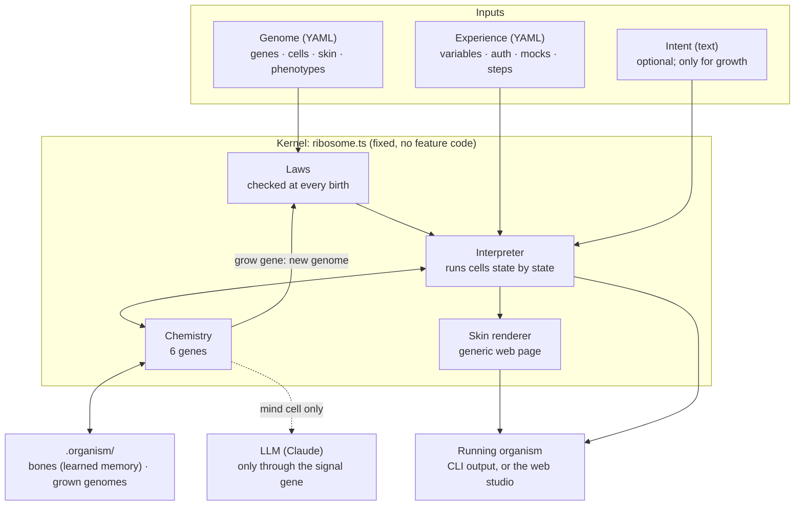
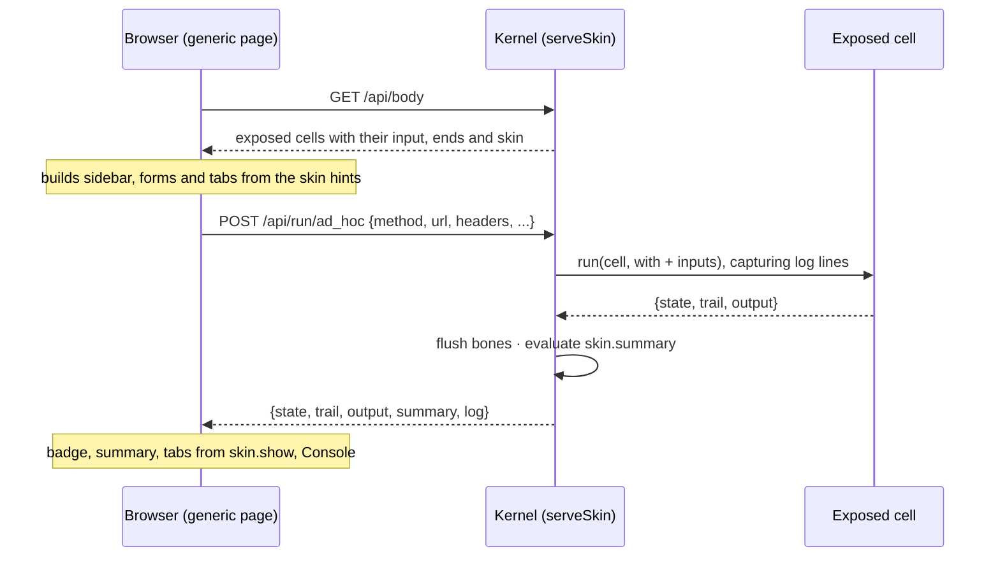
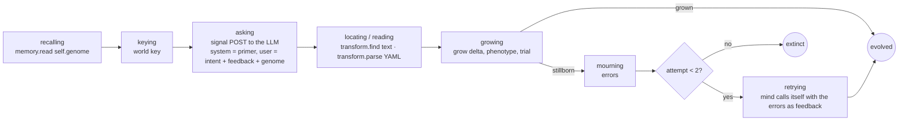

# Organism: architecture

How software grows from a genome, from the big picture down to individual functions.

**Contents**
1. [The one-paragraph version](#1-the-one-paragraph-version)
2. [Can it run without an LLM?](#2-can-it-run-without-an-llm)
3. [The big picture](#3-the-big-picture)
4. [The genome](#4-the-genome)
5. [The cell: the only unit](#5-the-cell-the-only-unit)
6. [The wiring language](#6-the-wiring-language)
7. [Genes: the only physics](#7-genes-the-only-physics)
8. [Memory and bones](#8-memory-and-bones)
9. [The laws](#9-the-laws)
10. [Skin: the UI is DNA too](#10-skin-the-ui-is-dna-too)
11. [Growth: how the organism writes its successor](#11-growth-how-the-organism-writes-its-successor)
12. [Walkthroughs](#12-walkthroughs)
13. [A second species: the hub (Zapier-lite)](#13-a-second-species-the-hub-zapier-lite)
14. [The current seed, cell by cell](#14-the-current-seed-cell-by-cell)
15. [Kernel code map](#15-kernel-code-map)
16. [Files on disk](#16-files-on-disk)
17. [Limits and next steps](#17-limits-and-next-steps)

---

## 1. The one-paragraph version

A small, fixed **kernel** (`ribosome.ts`) interprets a YAML **genome**. The kernel knows only physics: six genes, one recursive unit called the *cell*, a tiny wiring language, and a set of laws. Everything that makes the app Postman lives in the genome. That includes sending requests, auth, the collection runner, mocks, learned assertions, history and the whole web UI. One of the six genes, `grow`, hands the kernel back to the genome. A cell can therefore produce a new genome, have it checked against the laws, and grow it. The **mind** cell uses that to ask an LLM for DNA changes. The output of growth is always valid input to growth:

```
F(genome, intent)  →  F′ + intent′  →  F″ + intent″  →  …
```

## 2. Can it run without an LLM?

**Yes. Everything except evolving works fully offline with no LLM.** The LLM is used in exactly one place: the `mind` cell, when it asks for a DNA change.

| Capability | Needs an LLM? | How to use it |
|---|---|---|
| Send requests, `{{variables}}`, the auth → token chain | No | `npm run grow`, or the Request screen |
| Collection runner with assertions | No | `npm run grow`, or the Collection Runner screen |
| Load testing (×50 parallel) | No | `npm run load` |
| Mock server | No | `npm run mock` |
| Self-learned assertions (response-shape mutations) | No | Runs automatically after 3 identical runs |
| History of every exchange | No | Built in; History screen |
| The web UI (studio) | No | `npm run studio`, then open http://localhost:4000 |
| Laws, `--strict`, `--adopt` | No | CLI flags |
| **Growing a new feature from an intent** | **Yes** | `npm run evolve`, or the Evolve screen |
| Offline rehearsal of growth (a mock plays the LLM) | No | `npm run rehearse` |

Without an LLM you can still grow the organism by hand. Edit the genome YAML directly, with no TypeScript. The laws check your edit at the next birth, the same way they check the mind's.

## 3. The big picture



The last arrow, from the `grow` gene back into the laws, is what closes the loop. A new genome goes through exactly the same door as the seed.

### Layers

| Layer | What it is | Where it lives |
|---|---|---|
| **Physics** | 6 genes, the wiring language, the laws, the skin renderer | `ribosome.ts`. Changing it is rare, and it must stay generic. |
| **DNA** | Cells, their lifecycles, skins and phenotypes | `postman.genome.yaml`. This is where features live. |
| **Experience** | What to run it against | `collection.yaml`, `rehearsal.yaml` |
| **Bones** | What the organism remembers between runs | `.organism/<experience>.lock.json` |
| **Lineage** | Every genome the organism has grown | `.organism/genomes/*.yaml` |

### The one rule

**Nothing exists unless it can be traced back to genes.** `npm run strict` enforces this for the kernel: it fails if `ribosome.ts` mentions any cell or phenotype name that the genome defines.

## 4. The genome

A genome is one YAML file with these sections:

```yaml
genome:     { name: postman, version: 0.5.0, parent: postman@0.4.0 }   # identity + lineage
genes:      { signal: { params: [...], emits: [...] }, ... }            # which physics this organism uses
body:       { recall: [run, collection, env, global], bones: { dna: heritable, archive: kept } }
action:     { budget: { max_requests: 500 }, world: [ANTHROPIC_API_KEY, CLAUDE_API_KEY] }
cells:      { http_call: {...}, auth: {...}, studio: {...}, mind: {...}, ... }
phenotypes: { postman: { grow: postman, with: { parallel: 1 } }, studio: { grow: studio, persist: true, ... } }
active_phenotype: postman
```

- **`genes`**: which genes this organism uses, with their parameters and events. Each must be one the kernel actually has, with parameters and events it actually supports.
- **`body`**: the memory layout (see §8).
- **`action`**: the guardrails, i.e. a request budget and an allowlist of environment variables the organism may read.
- **`cells`**: every behaviour (see §5).
- **`phenotypes`**: a phenotype picks one root cell and gives it flags. The same DNA grows a different species depending on which phenotype is chosen:

| Phenotype | Root cell | Flags | What you get |
|---|---|---|---|
| `postman` | `postman` | `parallel: 1` | CLI collection run |
| `load_tester` | `postman` | `parallel: 50` | The same run, 50× concurrent |
| `mock_server` | `mock_world` | `persist: true` | A long-running mock API |
| `studio` | `studio` | `persist: true` + mind config | The web app on :4000 |
| `evolve` | `mind` | model, api, trial experience | One growth step from the CLI |
| `rehearse` | `rehearsal` | same as `evolve` | Growth with a mock LLM |

`persist: true` means the kernel keeps the organism's servers alive after the root cell finishes.

## 5. The cell: the only unit

Everything is a cell: an organ, a whole app, the UI, the mind. There's no separate "organ" or "service" type.

```yaml
http_call:
  genes: [signal, sense]              # genes this cell may call
  cells: []                           # other cells it may call (composition, recursion)
  input: [request, expect]            # names it accepts
  lifecycle:                          # ordered; the first state is the entry
    idle:    { to: sending }
    sending: { do: { signal: $request }, as: response, on: { received: judging, failed: failed } }
    judging: { do: { sense: { subject: $response, expect: $expect } }, as: checks, on: { pass: healthy, fail: sick } }
  ends: [healthy, sick, failed]       # terminal states
  fatal: []                           # ends that count as death
  output: { state: $state, trail: $trail, response: $response, checks: "$checks|default:[]" }
  skin: { ... }                       # optional: how it looks as a screen (§10)
```

### How a cell runs (`Organism.run`)

```mermaid
stateDiagram-v2
  direction LR
  [*] --> entry: input becomes scope
  entry --> state
  state --> call: has do
  call --> bind: gene or cell returns {event, output}
  bind --> next: as name = output
  state --> next: no do
  next --> state: to, or on[event], or on["*"]
  next --> [*]: reached an end → evaluate output
```

1. The cell's **scope** starts as its input.
2. At each state:
   - If there is a `do`, the kernel evaluates the arguments against the scope and calls exactly one callee.
   - The callee returns an **event** and an **output**. `as: name` stores the output in the scope.
3. The next state is `to` if present. Otherwise it is `on[event]`, or `on["*"]` as a fallback.
4. When the state is one of the `ends`, the cell stops.
   - `$state` (the end reached) and `$trail` (every state visited) are added to the scope.
   - `output` is evaluated and returned.
5. **When one cell calls another, the callee's end state becomes the caller's event.** This is what makes composition uniform: `a + b = ab`.

### Fan-out

| Form | Meaning |
|---|---|
| `do: { run_step: {...}, for: { step: $steps } }` | Runs sequentially, once per item. `step` is bound for each call. |
| `do: { http_call: {...}, times: 50 }` | Runs in parallel, N copies. |

Both return a **list** of outputs. The event is the shared event if every call ended the same way, otherwise `mixed`, or `none` for an empty list.

### Safety limits

- A cell may call only its declared genes and cells. This is enforced both statically and at runtime.
- A single cell run is capped at 10,000 transitions.

## 6. The wiring language

This is how data flows between states. The kernel evaluates it; `evaluate()` in the code map.

| Form | Result | Example |
|---|---|---|
| `"$a.b.c"`: the whole string | The raw value, of any type | `request: $request` |
| `"text ${a.b} text"` | An interpolated string | `"  ✔ ${step.name\|pad:22}"` |
| `\|filter:arg`, chainable | Transforms the value | `"$calls\|all:state:healthy"` |
| `$$…` / `$${` | Escapes for a literal `$` or `${` | Used in the mind's primer |

Paths use dots and indices: `calls.0.response.body.id`.

**Filters:**
`default` `pad` `json` `yaml` `join` `len` `keys` `first` `last` `reverse` `sum` `add` `map` `where` `all` `eq` `pct` `mark` `green` `red` `dim` `yellow`

**Not wiring: `{{var}}`.** This is Postman-style *runtime* templating. `memory: { fill: … }` performs it at runtime, looking names up through the `recall` chain. Wiring connects cells; `{{var}}` fills user data.

## 7. Genes: the only physics

Implemented in `chemistry()`. Each gene takes one argument map and returns `{ event, output }`.

| Gene | Operations (argument keys) | Emits | Notes |
|---|---|---|---|
| **signal** | `method, url, headers, body` → an HTTP call | `received` · `failed` | Counts against `action.budget`. Output: `{status, headers, body, time}` or `{error}`. |
| | `log` → prints a line | `sent` | The line is also captured into the UI's Console tab. |
| **memory** | `write`+`value`+`scope` · `write_all`+`scope` · `append`+`value`+`keep` | `written` | Keys are paths (`mutations.Who am I`). |
| | `read`+`scope` | `read` · `missing` | `read: ""` returns the whole scope. |
| | `fill` → resolves `{{var}}` in any value | `read` | |
| **sense** | `subject` + `expect` (+`target`) | `pass` · `fail` | An `expect` map means every check must pass. Output: a list of checks. |
| **transform** | `get` · `pick` · `merge` · `find`+`where` · `render`+`with` · `value` · `shape`+`prefix` · `stable` · `parse` | `done` · `none` | Pure data operations. `parse` reads YAML, including from a fenced block. |
| **trigger** | `on: http, port, cell, with` → a server that grows `cell` for each request | `listening` · `failed` | `failed` means the port is taken. |
| | `on: ui, port, title, expose, with` → serves the skin (§10) | `listening` · `failed` | Listens on 127.0.0.1 only. |
| **grow** | `delta` or `genome`, `phenotype`, `experience`, `with` | `grown` · `stillborn` | F itself (§11). |

**Sense grammar:**
- a literal (deep equality)
- `exists`
- `type:string|number|boolean|object|array|null`
- `<N` or `>N`

## 8. Memory and bones

The `Memory` class holds named **scopes**, which are created on demand.

| Scope | Filled by | Lifetime |
|---|---|---|
| `run`, `collection`, `env`, `global` | Cells (`environment` seeds `env`; `auth` writes the `token` into `collection`) | One organism lifetime |
| `self` | The kernel: `{ genome (as text), name, version }` | Read-only in practice; this is how the mind reads its own DNA |
| `world` | The kernel: only the env vars listed in `action.world` | Secrets such as the API key |
| **Bones** (from `body.bones`) | Cells | **Persisted** in `.organism/<experience>.lock.json` |

- `body.recall` is the lookup order that `{{var}}` uses: run → collection → env → global.
- **Bones:**
  - `dna: heritable` is learned DNA. Any change to it is a *mutation*, which bumps the lock's version and appends to its lineage.
  - `archive: kept` is remembered but not heritable, e.g. history and response shapes.
  - Bones are saved (`flush`) when the root cell settles, after **every UI action**, and after **every inbound HTTP request** a `trigger` server handles.

## 9. The laws

The laws make self-growth safe. Every genome is checked at birth: the seed, anything you edit by hand, and anything the mind writes. A single violation means the genome is **stillborn**, and the errors go back to the mind as feedback.

`laws()` checks that:
- every gene exists in the kernel's chemistry, with parameters and events it can express;
- every cell calls only genes and cells it declares;
- gene arguments are declared params, and cell arguments are the callee's `input`;
- a state has only the keys `do`, `as`, `to`, `on` (a misplaced `for`/`times` gets a hint that it belongs inside `do`);
- each state does exactly one thing, and has `to` **or** `on`, never both;
- every transition target is a state or an end, and ends don't overlap live states;
- `on:` listens only for events the callee can actually emit (a gene's `emits`, or a cell's `ends`, plus `mixed`/`none` for fan-out);
- every `$ref` is bound: by an input, an `as`, a `for` variable, or `state`/`trail`;
- `trigger` may spawn only declared cells, and `expose` only declared cells;
- a `skin` uses only known keys and widgets, and its fields are real inputs (`skinLaws()`);
- every phenotype grows an existing cell.

`guardrails()` adds rules for children only:
- a child's budget may not exceed its parent's;
- a child may not read env vars its parent can't;
- growth is at most 3 generations deep.

`purity()` (`--strict`) checks that the kernel mentions no name the genome defines.

## 10. Skin: the UI is DNA too

A root cell opens the UI with the `trigger` gene:

```yaml
opening: { do: { trigger: { on: ui, port: 4000, title: Postman, expose: [ad_hoc, collection_runner, history_view, environment_view, evolver], with: { experience: $experience, model: $model, ... } } }, ... }
```

The kernel serves **one generic page** (`SKIN_HTML`). It knows cells, inputs and outputs, never what they mean.



**Skin keys:**

| Key | Meaning |
|---|---|
| `title`, `icon`, `about` | Sidebar entry and screen header |
| `action` | Button label |
| `auto` | Run the cell as soon as the screen opens |
| `fields` | `{input: text\|textarea\|json\|number}` or `{widget, options, default, placeholder, label, span}` on a 12-column grid. If omitted, every input is shown. |
| `show` | A list of tabs: `{label, path, as: auto\|json\|table\|text, columns: {Header: path}}` |
| `summary` | Wiring evaluated over the output, e.g. `"${status} · ${time}ms"` |
| `badge`, `good` | Which output path to show as the status pill, and which values show green |

**Security:**
- The UI listens on 127.0.0.1 only.
- `POST` requests must be JSON (which forces a CORS preflight), and foreign `Origin`s are refused.
- Only exposed cells can run, and only their declared inputs are accepted.

Deep links work: `http://localhost:4000/#history_view`.

## 11. Growth: how the organism writes its successor

### The mind cell (DNA, not kernel)



- The mind is an ordinary cell. It talks to Claude through the plain `signal` gene: an HTTP POST to `/v1/messages` with the `x-api-key` and `anthropic-version` headers. The kernel doesn't know Claude exists.
- The **primer** is the `system` text inside the mind cell. It teaches the LLM the genome language, so the mind can rewrite its own primer too.
- The prompt contains the intent, feedback from the last attempt, the **trial experience** (as YAML, so tests use real data and ports), and the organism's own genome.
- The LLM returns a **delta**: only the entries to add or replace, as a fenced YAML block.

### The `grow` gene (kernel: `Organism.growChild`)

1. **Splice** the delta into the parent: whole entries are replaced, and `null` deletes one. This is `a + b = ab`.
2. **Version:** use the delta's version if it's newer, otherwise bump the minor version. Never reuse a file that already exists. Record `parent: name@version`.
3. **Laws + guardrails.** Any violation means `stillborn` with the errors. The rejected DNA is saved as `*.rejected.yaml` with the errors in its header, so failures can be read rather than guessed.
4. **Save** to `.organism/genomes/<name>-<version>.yaml`, using the compact serializer `dnaText()`.
5. **Birth the child** as a *trial* (its servers always close afterwards, even for `persist` phenotypes) against a trial experience (normally the `postman` phenotype on `collection.yaml`), with a slice of the parent's remaining budget. Its logs appear indented with `│`.
6. If the child dies, its file is renamed to `*.stillborn.yaml`. If it survives, the result is `grown`.

### Adoption

A grown child only takes over when you choose:

```bash
npx tsx ribosome.ts --adopt .organism/genomes/postman-0.7.1.yaml postman.genome.yaml
```

`--adopt` runs the laws again, then rewrites the seed. Git history is the undo.

### Learning (a smaller loop, no LLM)

The `learner` → `learn_step` cells:
- compute each healthy response's shape (`transform.shape`);
- append it to `archive.shapes.<step>`;
- once the last 3 shapes are identical (`transform.stable`), write `dna.mutations.<step>`.

That write is heritable, so the lock version bumps. The next run merges those mutations into the step's `expect` as extra senses.

## 12. Walkthroughs

### `npm run grow`: one CLI run

```
main → birth(seed, phenotype postman)
  laws ✔ → load collection.yaml → load lock bones → seed memory (self, world, dna, archive)
  run postman
    seeding    → environment      memory.write_all variables → env
    mocking    → mock             trigger on http :4010 (grows responder per request)
    authing    → auth             fill {{…}} → http_call POST /login → transform get token → memory write collection.token
    recalling  → memory.read dna.mutations
    running    → runner → run_step × each step
                   fill request → merge learned + step expect → http_call (× parallel)
                   → extract → print line → print failed checks
    learning   → learner → learn_step × each result (shapes, mutations)
    historizing→ historian → record_exchange × each result → archive.history
  close servers → flush bones (bump version if dna changed) → write lock
```

### A click in the studio

`npm run studio` grows the `studio` cell: seed env → mocks → auth → `trigger on: ui`. The process stays alive because of `persist: true`. Clicking **Send** on the Request screen:
1. The browser posts to `/api/run/ad_hoc`.
2. The kernel runs `ad_hoc` with `with` plus your fields: fill → `http_call` → `record_exchange` → log.
3. The kernel flushes bones, evaluates the summary (`200 · 3ms`), and returns output and log.
4. The page renders the tabs.

### An evolution

Clicking **Evolve** (or running `npm run evolve -- --with intent="…"`):
1. The `evolver` cell calls `mind`.
2. The mind reads its genome, asks Claude, parses the delta, and calls `grow`.
3. The kernel splices, checks the laws, saves `postman-X.Y.0.yaml`, and births it against `collection.yaml`.
4. The result is `🌳 evolved → X.Y.0`, or the mind retries using the laws' errors as feedback.

Real runs so far:

| Intent | Result | Time |
|---|---|---|
| History | First attempt | 30 s |
| Studio UI | Second attempt (the laws caught a broken `mind` cell on the first) | 2–5 min |
| Newest-first fix | First attempt, 1-line change | 11 s |

## 13. A second species: the hub (Zapier-lite)

To prove the kernel isn't Postman in disguise, a second species was grown from `hub.genome.yaml`, an **egg** holding only the six genes and the `mind` cell. The experience is `hub.yaml` (port 4100, sample webhooks, starting automations). Every generation had to ship a `selftest` phenotype that proves itself.

| Generation | Intent | Result |
|---|---|---|
| `hub@0.1.0` | (the egg) | 1 cell: `mind` |
| `hub@0.2.0` | "Grow into a webhook inspector" | 6 cells: a catch-all server, an inbox and a self-test. Stillborn 3× first, which exposed builder gaps (below); grew once those were fixed. |
| `hub@0.3.0` | "Add automations that transform and forward webhooks" | 9 cells. Automations are **data** (`when` sense map + `send` template), rendered with `$req.…` and delivered with `signal`, then logged to `archive.deliveries`. First attempt, about 3 min. |

**Builder gaps this second species exposed (all fixed in the builder, not the app):**
- The egg had no worked examples of fan-out, and the primer never said `for` goes *inside* `do`. The primer is now explicit, and a new law rejects unknown state keys with a hint.
- The mind never saw the experience file, so it invented its own test data. The prompt now includes it, and the primer states the `experience` input convention.
- Long-running servers only saved bones at startup, so data from HTTP requests was lost when the process stopped. Bones are now flushed after every inbound request.
- A trial birth of a `persist` phenotype would never exit. Trials now always close their servers.

Run it: `npx tsx ribosome.ts .organism/genomes/hub-0.3.0.yaml hub.yaml --phenotype serve` (or `selftest`).

## 14. The current seed, cell by cell

`postman@0.5.0`, 21 cells:

| Group | Cell | Genes | Calls cells | Purpose |
|---|---|---|---|---|
| **Atoms** | `http_call` | signal, sense | — | Send one request, judge it: `healthy`/`sick`/`failed` |
| | `environment` | memory | — | Write experience variables into `env` |
| | `responder` | sense, transform | — | Answer one mock request: route → `require` guard → render `$req.` |
| **Organs** | `auth` | sense, memory, transform, signal | http_call | Log in, extract the token, store it in `collection` |
| | `run_step` | memory, transform, sense, signal | http_call | One collection step, including parallel fan-out and reporting |
| | `runner` | signal | run_step | All steps plus the coverage line |
| | `mock` | trigger | responder | Mock HTTP server |
| | `learn_step` / `learner` | transform, memory, sense, signal | learn_step | Self-learned type assertions |
| | `record_exchange` / `historian` | transform, memory, signal | record_exchange | History archive |
| **Screens** (have `skin`) | `ad_hoc` | memory, transform, signal | http_call, record_exchange | 📮 Request |
| | `collection_runner` | memory | runner, learner, historian | ▶ Collection Runner |
| | `history_view` | memory, transform | — | 📜 History |
| | `environment_view` | memory, sense, transform | — | 🌍 Environment (view and set variables) |
| | `evolver` | — | mind | 🧬 Evolve |
| **Roots** | `postman` | memory | environment, mock, auth, runner, historian, learner | CLI app |
| | `mock_world` | signal | environment, mock | Mock-only app |
| | `studio` | trigger, signal | environment, mock, auth, and the 5 screens | Web app |
| **Growth** | `mind` | signal, memory, transform, sense, grow | mind (itself) | Writes the next genome |
| | `rehearsal` | — | mock, mind | Offline growth test |

## 15. Kernel code map

`ribosome.ts`, about 770 lines, has zero feature code:

| Section | Symbols | Role |
|---|---|---|
| Utils | `get`, `setPath`, `typeOf`, `isMap`, `literal` | Path access and small helpers |
| Wiring language | `FILTERS`, `WHOLE`, `PIECE`, `pipe`, `evaluate`, `refs`, `render` | `$refs`, `${…}`, filters. `refs` gives the laws static analysis. |
| Memory | `Memory` (`write`, `read`, `fill`) | Scopes, the recall chain, `{{var}}` |
| Chemistry | `CHEMISTRY`, `senseOne`, `chemistry()` | The 6 genes |
| Laws | `laws`, `skinLaws`, `guardrails`, `purity` | Validation at birth and in `--strict` |
| DNA text | `dnaText`, `splice`, `newer` | Compact serializer, delta merge, version compare |
| Organism | `Organism` (`run`, `invoke`, `growChild`, `say`, `flush`, `close`) | The interpreter and the `grow` gene |
| Skin | `serveSkin`, `SKIN_HTML` | Generic UI server and page |
| Birth | `birth` | Laws → phenotype → experience → lock → memory → run → flush |
| Entry | `main` | CLI flags: `--phenotype`, `--with k=v`, `--strict`, `--adopt` |

## 16. Files on disk

```
ribosome.ts                 kernel
postman.genome.yaml         seed genome (currently postman@0.5.0, adopted)
collection.yaml             main experience (self-contained mock world, offline)
rehearsal.yaml              experience where a mock plays the LLM
hub.genome.yaml             the egg for the second species (genes + mind only)
hub.yaml                    experience for the hub: port 4100, sample webhooks, automations
.env                        CLAUDE_API_KEY (gitignored; loaded by npm scripts via --env-file-if-exists)
.organism/                  gitignored, generated
  <experience>.lock.json      { born_from, version, lineage, bones: { dna, archive } }
  <experience>@<v>.lock.json  a child's lock during its trial birth
  genomes/<name>-<v>.yaml     every grown genome (delete one to undo it)
  genomes/*.stillborn.yaml    children that passed the laws but died at runtime
CLAUDE.md                   handoff doc for AI sessions
ARCHITECTURE.md             this document
```

## 17. Limits and next steps

- **Fitness is only "born and didn't die".** Nothing yet scores whether a child is better than its parent.
- **No hot-swap.** Evolve grows a child file, but the running studio keeps its own genome until it's restarted, or until you `--adopt`.
- **Port collisions are easy to miss.** If :4000 is taken, the studio ends in its fatal `blocked` state (exit code 1), but it prints no message, and whatever already holds the port keeps answering. The `blocked` path should log a clear line.
- **Growing the kernel's vocabulary** (filters, transform operations, widgets) is the main risk to keeping it generic. Add one only when no combination of existing ones can do the job.
- **Skin v1** is forms and panels. Saved requests, request tabs and collection editing would be grown as cells, possibly with a few new widgets.
