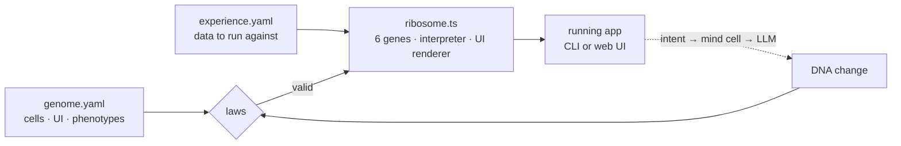

# 🧬 Organism

**Software that grows itself.** You don't write the app. You write (or ask for) its *DNA*: a small YAML genome. A tiny fixed runtime, the **ribosome**, grows a working app from it. The app can then grow its own next version from a plain-English intent, checked by laws before it's allowed to live.

```
F(genome, intent)  →  F′ + intent′  →  F″ + intent″  →  …
```

The same 800-line runtime has grown, with no feature code of its own:
- **a Postman-class API client**: requests, auth, collection runner, load tests, mocks, history, and a web UI;
- **a Zapier-like webhook hub**: an inbox, automations that transform and forward webhooks, and a web UI. It grew from an *empty egg* in five sentences.

---

## Quick start (60 seconds, no API key)

Requires **Node 22.9+**.

```bash
npm install
npm run hello          # the smallest organism, written by hand
npm run grow           # the Postman species: runs a collection against its own mock world
npm run studio         # the Postman UI → http://localhost:4000
```

Everything above runs offline. An LLM is only needed to **grow new features** (see [Grow things](#grow-things-needs-an-api-key)).

## Examples

| Example | What it shows | Try it |
|---|---|---|
| [`examples/hello`](examples/hello) | The whole language in about 60 commented lines: one cell, memory, a CLI root and a UI root. **Start here.** | `npm run hello` · `npm run hello:studio` → :4300 |
| Postman (repo root) | A full API client grown from `postman.genome.yaml` | `npm run grow` · `npm run load` · `npm run studio` → :4000 |
| [`examples/hub`](examples/hub) | A Zapier-like webhook hub, grown by the mind from the egg | `npm run hub:test` · `npm run hub:studio` → :4101 |
| [`examples/egg`](examples/egg) | Genes and a mind, nothing else. Grow **your** app from here. | See [Grow your own app](#grow-your-own-app-from-the-egg) |

## The idea in one picture



- **Everything is a cell**: a small state machine whose states call a gene or another cell. A feature, a screen, a whole app and the "mind" are all cells.
- **Six genes are the only physics**: `signal` (HTTP and logs), `memory`, `sense` (assertions), `transform`, `trigger` (servers and UI), and `grow` (the ribosome handed back to the genome, which is what makes self-growth possible).
- **The UI is DNA too.** Give a cell a `skin`, and it becomes a screen with a form built from its inputs and panels built from its outputs.
- **The laws** check every genome before it runs: the seed, your hand edits, and anything the mind writes. Broken DNA is rejected with precise errors, and the mind retries using them.

A cell looks like this (from [`examples/hello`](examples/hello/genome.yaml)):

```yaml
greet:
  genes: [memory, signal]
  input: [name]
  lifecycle:
    counting: { do: { memory: { append: visitors, value: "$name|default:world", scope: archive } }, as: visitors, to: greeting }
    greeting: { do: { signal: { log: "hello, ${name|default:world}! (visitor #${visitors|len})" } }, to: greeted }
  ends: [greeted]
  output: { message: "hello, ${name|default:world}!", visitor: "$visitors|len" }
  skin: { title: Greet, icon: 👋, fields: { name: text }, summary: "${message} · visitor #${visitor}" }
```

## Grow things (needs an API key)

Put a Claude API key in `.env` (it's gitignored):

```bash
echo "CLAUDE_API_KEY=sk-ant-..." > .env      # ANTHROPIC_API_KEY also works
```

Then describe a change:

```bash
npm run evolve -- --with intent="Add a Saved Requests screen: save the current request under a name and replay it."
```

The organism then:
1. reads its own genome;
2. asks Claude for a DNA change;
3. checks the change against the laws (retrying up to twice with the errors as feedback);
4. saves it as a new version in `.organism/genomes/`;
5. test-runs it in an isolated sandbox of ports.

**Your seed genome is never touched.** Try the child, then keep it if you like it:

```bash
npx tsx ribosome.ts .organism/genomes/postman-0.6.0.yaml collection.yaml --phenotype studio   # try it
npx tsx ribosome.ts --adopt .organism/genomes/postman-0.6.0.yaml postman.genome.yaml          # keep it (git is your undo)
```

Both studios (Postman and hub) have an **Evolve** screen, so you can do all of this from the browser.

Each evolution is one or more Claude API calls, billed to your key. Small changes take 10 to 60 seconds; a whole new UI takes a few minutes.

## Grow your own app from the egg

`examples/egg` holds only the genes and the mind. The hub was grown from it like this:

1. **Describe the test.** Edit `examples/egg/experience.yaml` to hold the ports, sample inputs and anything your app must prove. The mind reads this file.
2. **Grow in small steps**, one sentence at a time:
   ```bash
   G=examples/egg/genome.yaml; E=examples/egg/experience.yaml
   npx tsx --env-file-if-exists=.env ribosome.ts $G $E --phenotype evolve --with intent="Grow into ... Add a phenotype 'selftest' that proves it works against the experience and ends in a fatal state if any check fails."
   ```
3. **Grow from the child** each time. Pass the newest file in `examples/egg/.organism/genomes/` as the genome, with the next intent.
4. When you're happy, run `--adopt` to make it your seed.

Tips that made the hub grow cleanly:
- **Always ask for a `selftest` phenotype.** It is the child's proof of life. Without it, "grown" only means "didn't crash".
- **Keep one idea per intent.** "Add a UI" and "fix the sort order" worked best as separate steps.
- **Say what must not change**, e.g. "change nothing else; do not modify the mind cell".
- **Put runtime-editable things in memory, not in cells.** The hub's automations are data, so you can add one from the UI without an LLM.

## Commands

| Command | What it does |
|---|---|
| `npm run hello` / `hello:studio` | The hand-written starter, in the CLI or UI (:4300) |
| `npm run grow` | Postman: run `collection.yaml` (auth, steps, learned assertions, history) |
| `npm run load` | The same collection ×50 in parallel, with p50/p95 timings |
| `npm run mock` | Postman's mock server only, kept running |
| `npm run studio` | Postman web UI (:4000) |
| `npm run hub:test` / `hub:studio` | Hub self-test, or its web UI (:4101; the webhooks go to :4100) |
| `npm run evolve -- --with intent="…"` | Grow the Postman species (needs a key) |
| `npm run rehearse` | Offline growth test: a mock plays the LLM |
| `npm run strict` | Prove the ribosome contains no app-specific names |
| `npx tsx ribosome.ts <genome> <experience> [--phenotype p] [--with k=v]` | Run any genome |
| `npx tsx ribosome.ts --adopt <grown.yaml> <seed.yaml>` | Make a grown child the new seed |

Learned memory and grown genomes live in `.organism/` next to each experience file. Delete it to start fresh.

## Safety

- **Everything the mind writes goes through the laws** before it runs, and grown genomes live only in `.organism/`, so a mutation is one file you can delete.
- **Children never get more power than their parent**: no bigger request budget, no extra secrets, and at most 3 generations deep.
- **Only allowlisted environment variables are visible** (`action.world` in the genome).
- **Web UIs listen on 127.0.0.1 only** and refuse cross-site requests.
- **The ribosome itself never evolves.** Only YAML does. See [ARCHITECTURE.md §11](ARCHITECTURE.md#11-growth-how-the-organism-writes-its-successor) for why.

## Learn more

- [ARCHITECTURE.md](ARCHITECTURE.md): how it all works, from the big picture down to each kernel function.
- [CLAUDE.md](CLAUDE.md): working notes and rules for AI contributors.

## Status

This is an experiment that works. Both species run, grow and pass their tests. Not built yet:
- **Fitness scoring.** Children are judged by "passed its self-test", not by "better than its parent".
- **Hot-swapping** a running app to its grown child.
- **Richer UI widgets.** The skin is forms, tables and tabs today.
